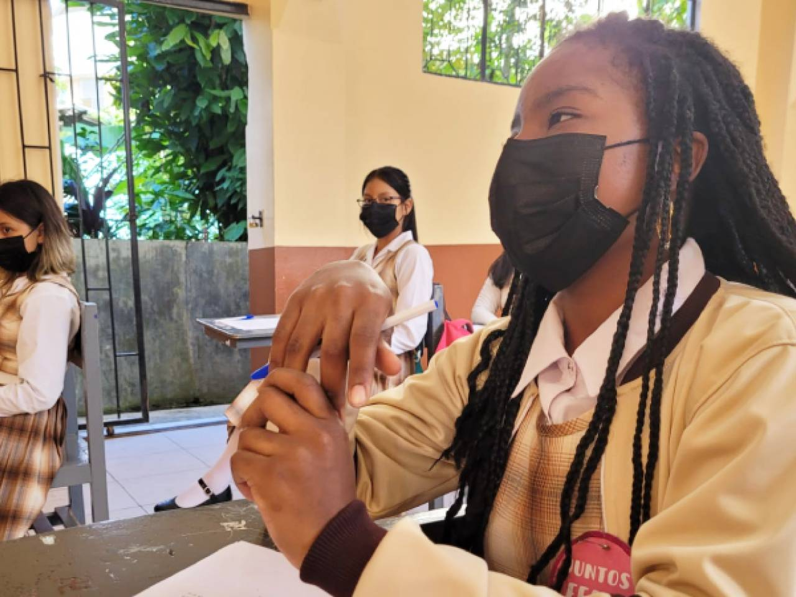

# UTPL 

## La ‘Fiesta de la Lectura’ llegó a Yantzaza y Loja

Los estudiantes de Bachillerato son los invitados principales de la ‘Fiesta de la Lectura’, que comenzó 18 de abril y concluye hoy. También se la denomina Semana Rosa, en el marco del Día Mundial del Libro.
It does not go in-depth into any particular topic - check out [Link](https://www.eloriente.com/articulo/la-fiesta-de-la-lectura-llego-a-yantzaza-y-loja/36104) 




```{tableofcontents}
```
